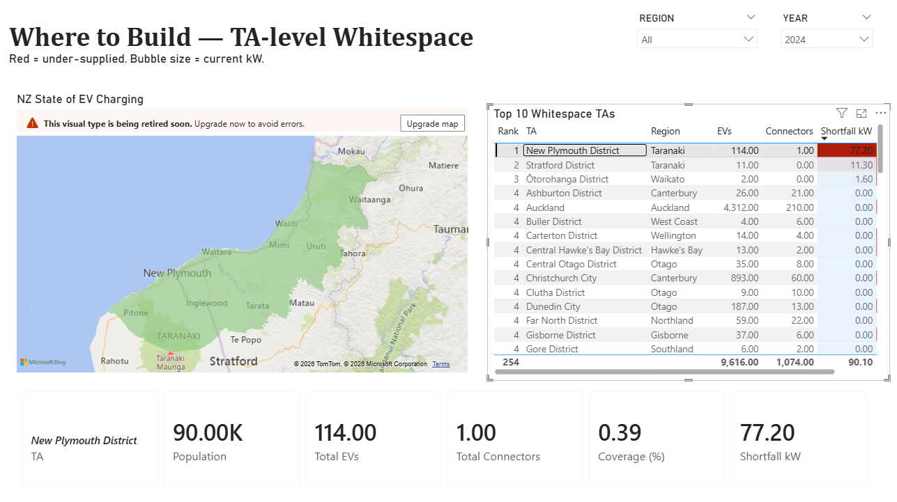

# NZ EV Charging Whitespace Analysis

> End-to-end ELT + analytics piece identifying commercial whitespace in New Zealand's public EV charging network. Where is supply lagging EV demand, and where is the most defensible site for a charging-network operator to build next?



## The question

By 2030, the New Zealand government wants 10,000 public charge points and a fast-charger hub every 150–200 km on State Highways. EV adoption is accelerating well ahead of supply growth. **For a charging-network operator with capital to deploy: which Territorial Authorities (TAs) should they build in next, and how big should each site be?**

## Headline findings

- **Every TA in NZ currently exceeds the EU AFIR baseline** for public charging capacity (1.3 kW per BEV + 0.8 kW per PHEV).
- That national surplus hides huge variance — Auckland sits ~4× the baseline; the most-stretched TAs sit at parity.
- **The defensible build whitespace** is in TAs where BEV growth has outpaced operator builds for 2+ consecutive years AND the dominant national operator (ChargeNet, 49.5% share) has limited local presence.
- The State Highway network has **no gap >75 km by great-circle distance** today (max 63 km, Karamea→Murchison). Highway gap-fill is a **second-wave** investment opportunity after TA whitespace.

## Stack

| Layer | Tool | Why |
|---|---|---|
| Warehouse | Snowflake (XS) | Native `GEOGRAPHY` type for `ST_CONTAINS`; cheap dev XS warehouse |
| Transformation | dbt-core 1.8 + dbt-snowflake | Medallion (bronze → silver → gold), 157 data tests, auto-generated docs |
| Visualisation | Power BI Desktop (PBIP) | Source-controllable folder format; 6-page operator narrative |
| Ingestion | Python (snowflake-connector, geopandas) | One-off loaders for Stats NZ Excel + LINZ GeoPackage |
| Lint | SQLFluff (Snowflake dialect, dbt templater) | Style consistency across 26 SQL models |

## Architecture

```
Raw (RAW)              Bronze (views, 1:1)         Silver (views, parse/dedup/spatial)        Gold (tables, marts)
──────────────         ──────────────────          ─────────────────────────────────          ────────────────────────────
MVR_VEHICLES      ─▶   brz_mvr__vehicles      ─▶   slv_vehicles__classified              ─▶   dim_vehicle_model
EVROAM_STATIONS        brz_evroam__stations        slv_stations__ta_assigned                  dim_geography
STATSNZ_POP_TA         brz_statsnz__population     slv_stations__capacity                     dim_station_operator
LINZ_TA_BOUNDARIES     brz_linz__ta_boundaries     slv_stations__connectors_exploded          dim_connector_type
                                                   slv_population__by_ta                      fct_vehicle_registration
                                                                                              fct_charging_station
                                                                                              fct_station_connector
                                                                                              fct_station_distance
                                                                                              agg_supply_demand__by_ta_year
                                                                                              agg_whitespace_ranking__current_year
                                                                                              agg_highway_gap__current
                                                                                              agg_operator_landscape__current
                                                                                              agg_national_summary__by_year
```

Full build (10 view models + 14 table models + 2 seeds + 157 tests) runs in **~67 seconds** on the XS Snowflake warehouse.

## Repo layout

| Path | Contents |
|---|---|
| `data/raw/` | Immutable source files (MVR CSV, EV Roam JSON) — read-only |
| `data/external/` | Stats NZ population, LINZ TA boundaries |
| `snowflake/ddl/` | One-time bootstrap: database, role, warehouse, schemas, file formats, stages, raw tables |
| `dbt/firn_ev/` | dbt project — 10 bronze views, 8 silver, 14 gold (5 dims, 4 facts, 5 aggregates), 157 tests, 2 seeds, 3 macros |
| `powerbi/` | PBIP report folder — 6 pages, 28 DAX measures, 15 relationships |
| `docs/deck/` | Presentation deck (`.pptx` + markdown source) + presenter script |
| `docs/screenshots/` | Dashboard page captures |
| `scripts/` | Python helpers: ingestion loaders, deck/docx generators, seed builder |

## Reproducing the build

Prerequisites: Snowflake trial account, Python 3.11+, Power BI Desktop.

1. **Snowflake bootstrap** — run scripts in `snowflake/ddl/01..06` in order via Snowsight or SnowSQL. Creates database, role, warehouse, schemas, file formats, stages, and raw tables.
2. **Raw data** — `PUT` the files in `data/raw/` into the internal stage, then `COPY INTO` the raw tables (covered step-by-step in `docs/SNOWFLAKE_RUNBOOK.md`).
3. **External data** — copy `.env.example` → `.env`, fill in Snowflake values. Then `python scripts/load_statsnz_population.py` + `python scripts/load_linz_ta_boundaries.py`.
4. **dbt build** — copy `profiles.yml.example` → `~/.dbt/profiles.yml`, fill in values. Then `cd dbt/firn_ev && dbt deps && dbt build`. All 32 models + 157 tests in ~67 s.
5. **Power BI** — open `powerbi/firn_ev.pbip` in Power BI Desktop. Replace the placeholder account locator in `firn_ev.SemanticModel/definition/tables/*.tmdl` with yours, then refresh.

## Benchmarks (locked)

Two stacked benchmarks define "is supply enough?" — both surfaced in the dashboard.

**A. EU AFIR (headline, kW-based)**
- 1.3 kW per BEV; 0.8 kW per PHEV
- Distance rule (analogue for NZ State Highways): pool every 60 km, ≥400 kW total, ≥1 point ≥150 kW

**B. NZ National EV Charging Strategy (context, count + distance)**
- 10,000 public charge points by 2030
- DC fast charger every 75 km on State Highways (legacy, ~complete)
- Charger hubs every 150–200 km on State Highways (current target)

## Tests

157 dbt tests across three libraries:

| Library | Purpose | Example |
|---|---|---|
| dbt-core | `not_null`, `unique`, `accepted_values`, `relationships` | EV cohort enum (`BEV`/`PHEV`/`HEV`/`FCEV`/`ICE`), FK from facts to dims |
| `dbt_utils` | Composite-key uniqueness | `(station_id, connector_seq)` on exploded connectors |
| `dbt_expectations` | Range and distributional checks | NZ lat/lon bounding box, `distance_km ∈ [0, 2500]` |

Every model has at minimum `not_null` + `unique` on its grain key. Every FK has a `relationships` test. Severity is tuned surgically — the lat/lon bounding-box test is set to `warn` because the Chatham Islands legitimately sits east of the antimeridian and would break the build otherwise.

## Data sources

All datasets are public and licensed CC BY 4.0.

| Dataset | Path | Publisher |
|---|---|---|
| Motor Vehicle Register | `data/raw/Motor_Vehicle_Register_API_dt.csv` | Waka Kotahi NZ Transport Agency, via [data.govt.nz](https://catalogue.data.govt.nz/) |
| EV Roam Charging Stations | `data/raw/EV_Roam_charging_stations_data.json` | Waka Kotahi NZ Transport Agency / EECA, via [data.govt.nz](https://catalogue.data.govt.nz/) |
| Subnational Population by TA (30 June 2024) | `data/external/statsnz_subnational_pop_2024_provisional.xlsx` | Stats NZ Tatauranga Aotearoa |
| Territorial Authority 2023 (clipped, generalised) | `data/external/territorial-authority-2023-clipped-generalised.gpkg` | Land Information New Zealand (LINZ) |

## Caveats surfaced in the dashboard

1. **MVR is a snapshot** of currently-registered vehicles, reconstructed by `FIRST_NZ_REGISTRATION_YEAR`. Pre-2018 fleet counts are biased downward (survivorship). Focus window: 2018+.
2. **EV Roam doesn't include decommissioned stations**, so historical station counts are slightly low. Forward-looking whitespace analysis is unaffected.
3. **PHEVs draw weakly on public DC.** AFIR's 0.8 kW weight (vs 1.3 kW for BEVs) captures this; "1 EV = 1 demand unit" is never used anywhere in the model.
4. **Great-circle distance ≠ road distance.** NZ State Highway distance is 30–50% longer by road than by air. Headline highway gap stats use great-circle; the dashboard flags this explicitly.
5. **TA boundaries change over time** (e.g., Tauranga reorganisations). Pinned to LINZ TA 2023 generalised layer.

## License

[MIT](./LICENSE)
